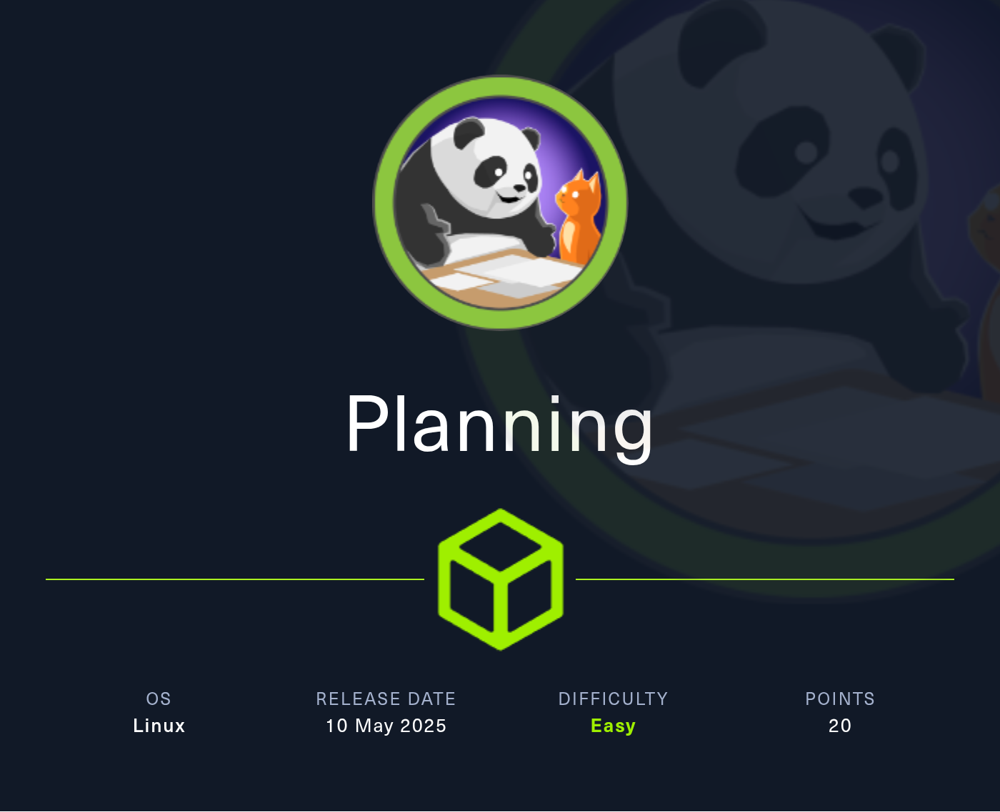

## Nmap Scan

```jsx
└─$ nmap -p 22,80 -sV -O -sC --min-rate=500 planning.htb -oN nmap_all

Starting Nmap 7.95 ( [https://nmap.org](https://nmap.org/) ) at 2025-06-12 08:50 EDT
Nmap scan report for planning.htb (10.10.11.68)
Host is up (0.12s latency).

PORT   STATE SERVICE VERSION
22/tcp open  ssh     OpenSSH 9.6p1 Ubuntu 3ubuntu13.11 (Ubuntu Linux; protocol 2.0)
| ssh-hostkey:
|   256 62:ff:f6:d4:57:88:05:ad:f4:d3:de:5b:9b:f8:50:f1 (ECDSA)
|_  256 4c:ce:7d:5c:fb:2d:a0:9e:9f:bd:f5:5c:5e:61:50:8a (ED25519)
80/tcp open  http    nginx 1.24.0 (Ubuntu)
|_http-title: Edukate - Online Education Website
|_http-server-header: nginx/1.24.0 (Ubuntu)
Warning: OSScan results may be unreliable because we could not find at least 1 open and 1 closed port
Device type: general purpose
Running: Linux 4.X|5.X
OS CPE: cpe:/o:linux:linux_kernel:4 cpe:/o:linux:linux_kernel:5
OS details: Linux 4.15 - 5.19
Network Distance: 2 hops
Service Info: OS: Linux; CPE: cpe:/o:linux:linux_kernel

OS and Service detection performed. Please report any incorrect results at https://nmap.org/submit/ .
Nmap done: 1 IP address (1 host up) scanned in 13.02 seconds
```


This box is still active on HackTheBox. Once retired, this writeup will be published for public access as per HackTheBox's policy on publishing content from their platform